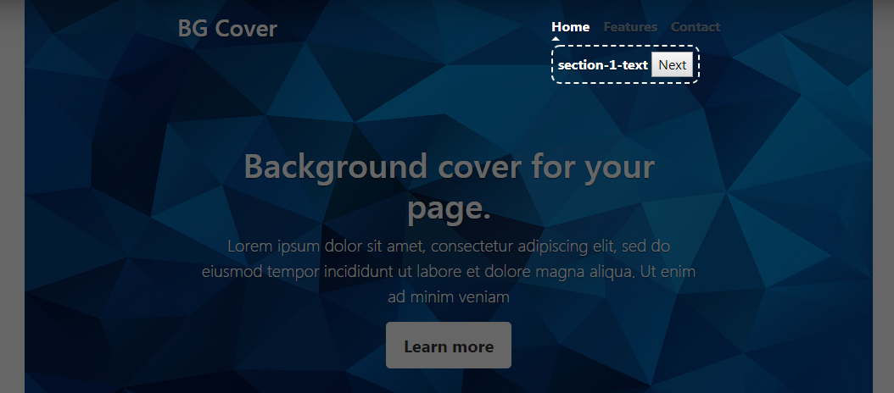

# introJS

A simple jQuery function which provide a tutorial kind of functionality for your web application.
It will extend your web application's capabilities and allow you to minimize the training part for your application.
First time visitors can get introduced to your site content/functionality.
A new digital sitemap.

# USAGE :::::::
<ul><li> Step 1: Include the introJS in your application's head/body/footer as per your framework structure.  <pre><code>&#x3C;script src=&#x22;intro.js&#x22;&#x3E;&#x3C;/script&#x3E;</code></pre>
 <b>Note::</b> <u>jQuery is prerequisite. <b>Place it above the introJS</b></u>.   You can use jQuery version of your choice, for easy reference: <pre><code>&#x3C;script src=&#x22;https://ajax.googleapis.com/ajax/libs/jquery/3.3.1/jquery.min.js&#x22;&#x3E;&#x3C;/script&#x3E;</code></pre></li>
 <li>Step 2: Provide classes for your elements for which introduction is required. <i>Example - </i> 
 <pre><code> &#x3C;div class=&#x22;section1&#x22;&#x3E;Section 1&#x3C;/div&#x3E;
 &#x3C;div class=&#x22;section2&#x22;&#x3E;Section 2&#x3C;/div&#x3E;
 &#x3C;div class=&#x22;section3&#x22;&#x3E;Section 3&#x3C;/div&#x3E;</code></pre></li>
 <li> Step 3: Call JS function `initiateIntro(arrOfJson,nextBtnClassName,closeBtnClassName,enableScroll)` on document load. 
 <i>Explaining -</i> 
   <ol><li>There are 4 parameters for the function, as below ::</li>
   <li><i>arrOfJson - </i> You need to provide a string of json array.  Example:: 
    <pre><code>&#x27;[{&#x22;class&#x22;:&#x22;section1&#x22;,&#x22;msg&#x22;:&#x22;section-1-text&#x22;},{&#x22;class&#x22;:&#x22;section2&#x22;,&#x22;msg&#x22;:&#x22;section-2-text&#x22;},{&#x22;class&#x22;:&#x22;section3&#x22;,&#x22;msg&#x22;:&#x22;section-3-text&#x22;}]&#x27;
    </code></pre>
   </li>
   <li><i>nextBtnClassName - </i> This param is used to change the CSS of the next button using your predefined class/classes. If not applicable; pass an empty string as param.</li>
   <li><i>closeBtnClassName - </i> This param is used to change the CSS of the close/done button using your predefined class/classes. If not applicable; pass an empty string as param.</li>
   <li><i>enableScroll - </i> Binary param(true/false); when an element to be introduced is off the screen/introduction area it will scroll the page until the element is visible.</li>
 </ol>
 </li>
 <li>
  Step 4: After executing the function, you will see an introduction pane.  
  
   Easy Right :)
 </li>
 <li>CSS Class - `<i>above-highlight</i>` is used to highlight the element above the shadowed-overlay. So if you want you can add your custom css in your css file using that class which will be applied when the introduction is triggered for that element</li>
</ul>
